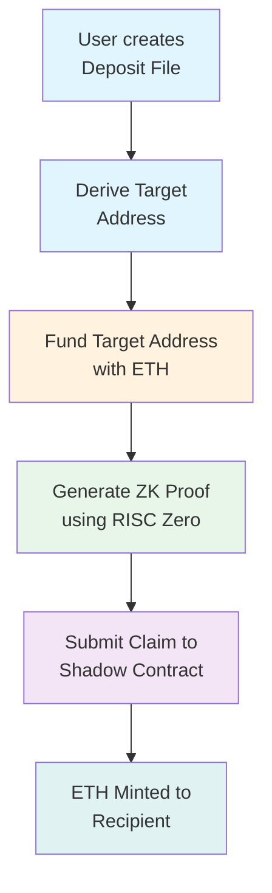

# Shadow: Reclaim Your ETH Privacy — A Complete Guide

*Written for crypto-savvy users who want financial privacy without the complexity*

---

## 1. What is Shadow?

Imagine you could prove you have ETH without telling anyone who you are or how much you have. That's essentially what Shadow does.

**The Problem:** Ethereum is transparent. Anyone can look up your wallet, see your balances, trace your transactions, and follow your money. For many people — traders, privacy-conscious users, even businesses — this is a problem. You might not want the world knowing your financial situation or who you're paying.

**What Shadow Does:** Shadow is a privacy-preserving system that lets you claim ETH on Taiko L2 (a Layer 2 rollup) without linking your identity to the transaction. It uses something called **zero-knowledge proofs** (ZK proofs) — a type of cryptographic magic that lets you prove something is true without revealing the details.

Think of it like a sealed envelope: you can prove you have $100 inside without showing who put it there or even opening the envelope.

### The Key Insight

Unlike traditional privacy mixers (like the now-sanctioned Tornado Cash), Shadow doesn't pool everyone's funds together. Instead, you:

1. Send ETH to a special "derived" address (a normal ETH transfer)
2. Later, generate a ZK proof that proves that address held enough ETH
3. Claim that ETH to a new address you control

The blockchain sees a deposit... and later a claim... but it can't connect the two.

---

## 2. How It Works (Simplified)

Let's walk through the flow step by step.

### Step 1: Create Your "Deposit File"

You start by creating a deposit file. This is a JSON file that contains:

- A **secret** (like a password, but randomly generated)
- A list of **notes** — essentially payment instructions (who gets what amount)

You can create 1 to 5 notes per deposit, with a maximum total of 32 ETH.

```
┌─────────────────────────────────────────────────────────────────┐
│                     DEPOSIT FILE                                │
├─────────────────────────────────────────────────────────────────┤
│  secret: 0x7a2f...e9c1        (keep this private!)             │
│                                                                 │
│  notes:                                                         │
│    • Note 0: Send 1.0 ETH to 0xABCD...                         │
│    • Note 1: Send 0.5 ETH to 0xEFGH...                         │
│    • Note 2: Send 2.0 ETH to 0xIJKL...                         │
└─────────────────────────────────────────────────────────────────┘
```

### Step 2: Derive Your "Target Address"

From your secret and notes, Shadow mathematically derives a unique **target address**. This address looks like a normal Ethereum address, but here's the trick: **nobody has the private key for it**.

```
┌─────────────────────────────────────────────────────────────────┐
│                   TARGET ADDRESS DERIVATION                     │
├─────────────────────────────────────────────────────────────────┤
│                                                                 │
│   secret + notes ──► SHA256 hash ──► Target Address            │
│                                                                 │
│   0x7a2f...e9c1  +  [notes]  ──►  0x1234...abcd               │
│                                                                 │
│   This address is "unspendable" — no private key exists!       │
│                                                                 │
└─────────────────────────────────────────────────────────────────┘
```

### Step 3: Fund the Target Address

You send ETH to that target address using a normal Ethereum transfer. This looks exactly like any other ETH transaction — there's nothing special or suspicious about it.

```
┌─────────────────────────────────────────────────────────────────┐
│                         STEP 3: FUND                            │
├─────────────────────────────────────────────────────────────────┤
│                                                                 │
│   Your Wallet                                                   │
│       │                                                         │
│       │  Normal ETH transfer                                    │
│       ▼                                                         │
│   ┌─────────────────────────────────────┐                      │
│   │  To: 0x1234...abcd                  │                      │
│   │  Amount: 3.5 ETH                     │                      │
│   └─────────────────────────────────────┘                      │
│              │                                                  │
│              │  (Looks like any normal transaction)            │
│              ▼                                                  │
│       Target Address Balance: 3.5 ETH                          │
│                                                                 │
└─────────────────────────────────────────────────────────────────┘
```

### Step 4: Generate Your ZK Proof

Now comes the cryptographic magic. You run software that generates a **zero-knowledge proof**. This proof demonstrates, mathematically, that:

- The target address held at least the total amount of your notes
- You know the secret that derives that address
- This is all proven WITHOUT revealing your secret or linking to your identity

```
┌─────────────────────────────────────────────────────────────────┐
│                    STEP 4: PROVE                                 │
├─────────────────────────────────────────────────────────────────┤
│                                                                 │
│   Private Inputs (you keep these):                             │
│   ┌─────────────────────────────────────────────────────────┐   │
│   │ • Your secret                                          │   │
│   │ • The full note set (all recipients & amounts)         │   │
│   │ • The account proof from Ethereum                      │   │
│   └─────────────────────────────────────────────────────────┘   │
│                            │                                     │
│                            ▼                                     │
│              ┌─────────────────────────┐                        │
│              │   ZK PROVER (RISC Zero)  │                       │
│              │   - Generates proof      │                       │
│              │   - Proves balance       │                       │
│              │   - Hides all secrets    │                       │
│              └─────────────────────────┘                        │
│                            │                                     │
│                            ▼                                     │
│   Public Output:                                                │
│   ┌─────────────────────────────────────────────────────────┐   │
│   │ • "This proof is valid" (yes/no)                        │   │
│   │ • Recipient address (0xEFGH...)                         │   │
│   │ • Amount (0.5 ETH)                                      │   │
│   │ • A "nullifier" (prevents double-claiming)              │   │
│   └─────────────────────────────────────────────────────────┘   │
│                                                                 │
└─────────────────────────────────────────────────────────────────┘
```

### Step 5: Claim Your ETH

Finally, you submit the proof to the Shadow contract on Taiko L2. The contract verifies the proof (without learning your secrets) and mints the ETH to your specified recipient address — minus a small 0.1% fee.

```
┌─────────────────────────────────────────────────────────────────┐
│                      STEP 5: CLAIM                              │
├─────────────────────────────────────────────────────────────────┤
│                                                                 │
│   You submit to Shadow Contract:                                │
│   ┌─────────────────────────────────────────────────────────┐   │
│   │ • ZK Proof                                              │   │
│   │ • Recipient: 0xEFGH...                                  │   │
│   │ • Amount: 0.5 ETH                                        │   │
│   │ • Nullifier: 0x9876...                                  │   │
│   └─────────────────────────────────────────────────────────┘   │
│                            │                                     │
│                            ▼                                     │
│              ┌─────────────────────────┐                        │
│              │   SHADOW CONTRACT        │                        │
│              │   1. Verifies proof      │                        │
│              │   2. Checks nullifier    │                        │
│              │   3. Mints ETH (minus    │                        │
│              │      0.1% fee)           │                        │
│              └─────────────────────────┘                        │
│                            │                                     │
│                            ▼                                     │
│   Result:                                                                 
│   ┌─────────────────────────────────────────────────────────┐   
│   │   Recipient gets: 0.4995 ETH (0.5 - 0.1% fee)           │   
│   │   Fee recipient gets: 0.0005 ETH                        │   
│   └─────────────────────────────────────────────────────────┘   
│                                                                 
└─────────────────────────────────────────────────────────────────┘
```

### Complete Flow Diagram



---

## 3. Who Should Use Shadow?

Shadow is useful for several groups of people:

### Privacy-Conscious Users
- You don't want strangers seeing your financial activity
- You want to separate your identity from certain transactions
- You're tired of people tracing your on-chain movements

### DeFi Traders
- **Front-running protection**: MEV (Maximal Extractable Value) searchers often target visible transactions. Shadow adds a layer of obfuscation.
- **Strategic positioning**: Keep your trading positions private

### Businesses
- Pay employees, vendors, or contractors without exposing company finances
- Make strategic acquisitions without announcement

### Anyone Wanting Financial Separation
- Move funds between wallets without creating an on-chain link
- Donate to causes without revealing your identity

---

## 4. Getting Started: What You Need

### Hardware Requirements

Here's the honest truth: Shadow is **not yet a plug-and-play web app**. Using it today requires some technical setup:

| Component | Requirement |
|-----------|-------------|
| **Computer** | Modern laptop or desktop |
| **Operating System** | macOS, Linux, or Windows with WSL |
| **Memory (RAM)** | 16GB+ recommended |
| **Storage** | 10GB+ free space |
| **Docker** | Required for Groth16 proof generation |

### Software Prerequisites

```bash
# You'll need these installed:
- Node.js 18 or higher
- Rust toolchain
- Docker Desktop
- Foundry (for smart contract interactions)
```

### Knowledge Required

You should be comfortable with:

- Using the command line/terminal
- Understanding basic Ethereum concepts (wallets, addresses, gas)
- Running npm/node commands
- Reading technical documentation

### The Current User Experience

**Note:** Right now, Shadow operates on **Taiko Hoodi testnet**. This is a test environment — there's no real money involved. The experience involves:

1. Generating a deposit file (can use the web UI)
2. Running CLI commands to generate proofs
3. Submitting claims via the UI

A more user-friendly experience is on the roadmap, but for now, expect a technical setup process.

---

## 5. Shadow vs. The Alternatives

How does Shadow compare to other privacy tools? Let's look at the landscape:

### Comparison Table

| Feature | Shadow | Tornado Cash | Railgun | Aztec |
|---------|--------|-------------|---------|-------|
| **Status** | Active (testnet) | Sanctioned/shut down | Active | Active |
| **Anonymity Set** | None (not a mixer) | Large (pooled funds) | Large | Large |
| **Chain** | Taiko L2 | Ethereum | Multiple | Aztec L2 |
| **ZK Technology** | RISC Zero | Merkle trees | ZK-SNARKs | PLONK |
| **Amount Privacy** | ❌ Public | ✅ Hidden | ✅ Hidden | ✅ Hidden |
| **Recipient Privacy** | ❌ Public | ✅ Hidden | ✅ Hidden | ✅ Hidden |
| **Linkability** | Low (no deposit contract) | Medium | Low | Low |
| **Ease of Use** | Technical | Moderate | Moderate | Moderate |

### What Makes Shadow Different?

**1. No Deposit Contract**
Traditional mixers use a deposit contract where everyone sends funds to the same place. This creates a "pool" but also makes it easy to monitor. Shadow uses **normal ETH transfers** to a derived address — there's no special contract to watch.

**2. Taiko Integration**
Shadow is built specifically for **Taiko**, an Ethereum-equivalent L2 rollup. This means:
- Low fees (L2 economics)
- Ethereum compatibility (EVM-native)
- Future mainnet potential

**3. RISC Zero ZK Proofs**
Shadow uses **RISC Zero** — a zero-knowledge virtual machine that's innovative in how it generates proofs. It's newer technology with a different trust model than traditional ZK circuits.

**4. Honest About Limitations**
Shadow's documentation explicitly states: "Shadow is **not a mixer**. It does not provide a large anonymity set, and it does not hide recipients or claim amounts."

This transparency is refreshing in the privacy space.

---

## 6. Current Status & Limitations

### Where Is Shadow Today?

- **Network**: Taiko Hoodi (testnet)
- **Phase**: Active development / testing
- **ETH**: Testnet ETH only (no real value)

### What You Can't Do (Yet)

- ❌ Use on Ethereum mainnet
- ❌ Use with real ETH
- ❌ Hide the recipient address (it's public in the claim)
- ❌ Hide the amount (it's public in the claim)
- ❌ Get perfect anonymity (no large anonymity set)

### What's Working

- ✅ Full deposit → prove → claim flow
- ✅ ZK proof generation (RISC Zero + Groth16)
- ✅ Smart contract verification
- ✅ Web UI for deposit file creation

### What to Watch For

- Mainnet deployment timeline
- Improved user experience / UI
- Potential integrations with wallets

---

## 7. Privacy Guarantees & What Shadow Does NOT Protect

Let's be completely clear about what Shadow does and doesn't do.

### What Shadow Hides (By Design)

✅ **Your secret** — Never published on-chain  
✅ **Full note set** — Nobody sees all your payment instructions  
✅ **Deposit-to-claim link** — No explicit on-chain connection between funding address and claim  

### What Becomes Public

⚠️ **Funding transaction** — The ETH transfer to your target address is visible (it's a normal ETH transfer)  
⚠️ **Recipient address** — Who's receiving the ETH is public  
⚠️ **Claim amount** — How much ETH is being claimed is public  
⚠️ **Timing** — If you fund and claim quickly, observers might correlate them  

### Privacy Guarantees

**Shadow does NOT guarantee anonymity.** From the official documentation:

> "Shadow provides privacy features but does not guarantee anonymity."

This is important to understand. Shadow adds a layer of obfuscation, but it's not a pseudonymizer like Monero or a mixer with a large anonymity set.

### What You Should NOT Expect

❌ Don't expect perfect privacy if you're a person of interest  
❌ Don't expect the blockchain to forget your funding transaction  
❌ Don't expect to hide what you're doing from sophisticated analysis  

### Operational Recommendations

If you use Shadow and want maximum privacy:

1. **Use fresh addresses**: Create new wallets for funding
2. **Time separation**: Wait between funding and claiming
3. **Consider relayers**: Use a relayer to submit the claim so your wallet isn't the transaction sender
4. **Treat your deposit file like a private key**: Don't lose it, don't share it

---

## 8. Getting Involved

### Community & Development

- **GitHub**: [github.com/taikoxyz/shadow](https://github.com/taikoxyz/shadow)
- **Taiko Discord**: [discord.gg/taikooxyz](https://discord.gg/taikooxyz)

### How to Contribute

1. **Try it out** — Test the flow on Hoodi, report bugs
2. **Build** — The project is open source; pull requests welcome
3. **Document** — Help improve user-facing docs
4. **Audit** — Security researchers, check the code

### Security

For security concerns, contact: **security@taiko.xyz**

---

## Summary

Shadow represents an interesting approach to Ethereum privacy: instead of pooling funds like a mixer, it uses zero-knowledge proofs to let you prove you had ETH at a certain address without revealing who you are. It's:

- **Not a mixer** — No large anonymity set
- **Built on Taiko** — Low fees, Ethereum-compatible
- **Technically sophisticated** — Uses RISC Zero ZK proofs
- **Transparent** — Honest about its limitations

If you're technically inclined and want to experiment with ZK privacy on testnet, Shadow is worth exploring. Just keep your expectations realistic — it's a privacy *tool*, not a perfect anonymity solution.

---

*This article was written to help non-developer crypto users understand Shadow. For technical documentation, check the [Shadow GitHub repo](https://github.com/taikoxyz/shadow).*
